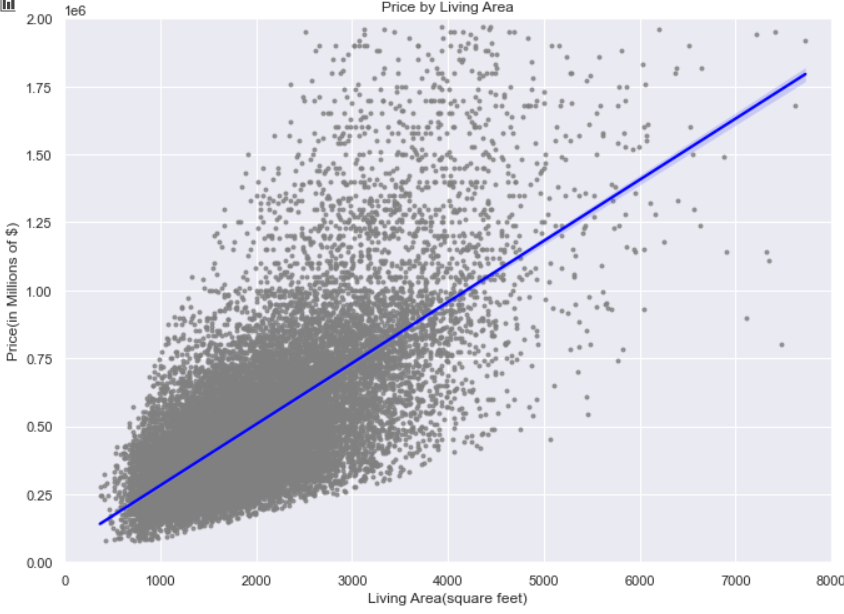
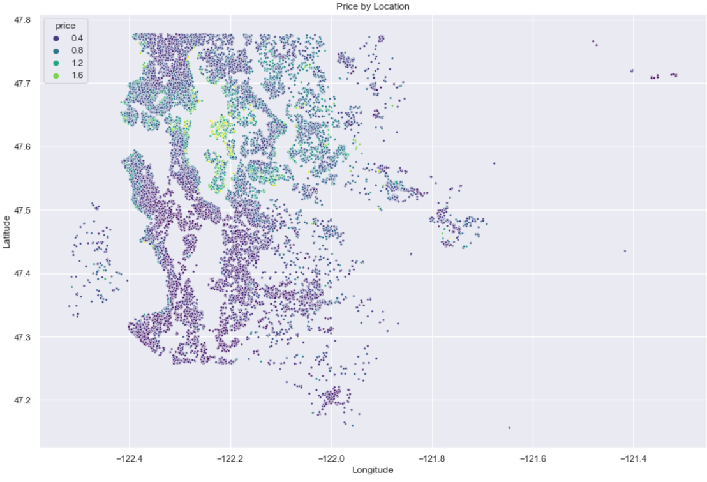
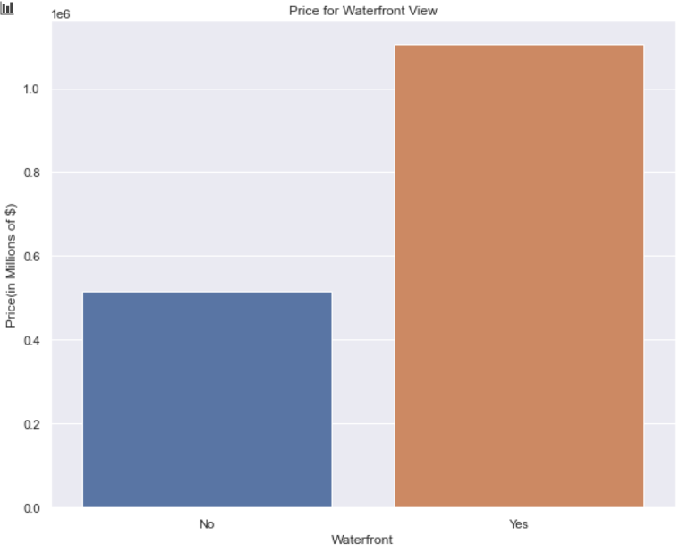
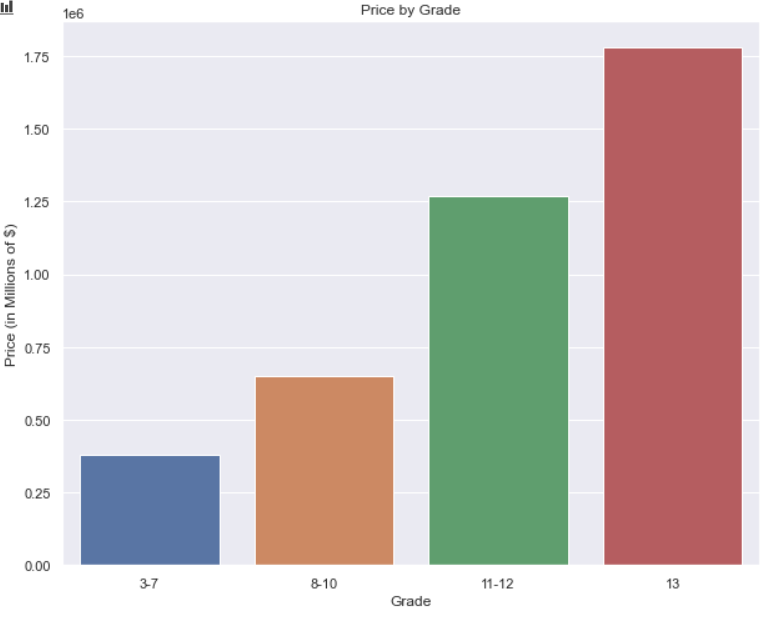

# Housing Analysis for Microsoft


**Author**: [Mohammed Siddiqui](mailto:saifword@live.com)

## **Overview**
 
This project analyzes King County housing data from 2014 and 2015 in order to make recommendations as to which factors most significantly impact the sale price of a house.

## **Business Problem**


Microsoft now has over 50,000 employees working on its main campus.  We would like to provide our new hires, as well as existing employees in the area with detailed information about procuring housing long-term.

In order to do so, we will need to determine which factors most effect the sale price of a house, which we can accomplish by creating a model to predict prices based on available data.


## **Data**

The main source of data we will work with is the King County Housing dataset.
    kc_house_data.csv

In order to perform some feature engineering, we have used 2018 data from census.gov to get the median household income for each Zipcode
    ZIP_codes_2018.xls

## **Methods**

For the purposes outlined above, we will use a variety of methods and modules:

* Numpy
* Scipy
* Pandas
* Matplotlib
* Seaborn
* Statsmodels
* Sklearn

## **Results**

### **Living Area**
As the living area of a house increases. So does the price.



### **Location**
The location of a house, particularly, proximity to our Redmond Campus significantly increases price.



### **Waterfront**

Houses with a waterfront view attract a much higher price.



### **Quality**

The quality of the house itself (its grade) makes a big impact.  This is especially true of houses with a grade above 11.




## **Conclusions about Model**

* We have a model that has an Coefficient of Determination(R-squared) value of 0.812 which indicates that our model can explain 81.2% of all vatiation in the data around the mean. This is a bit higher than I had expected at the start of the project, but performing feature engineering on the latitude and zipcode columns appears to have helped.

* With a Mean Squared Error of around 85,000, that means our predicted price is, on average, 85,000 off from our mean of approximately 518,500. While that number doesn't look too bad our, Root Mean Squared Error is around 130,000 which means that our model is being heavily penalized for predictions that are very far off the actual price.

* An explanation for that discrepancy might be the distribution of our residuals. While the distribution is has a normal shape, the tails are heavy which indicates that we have some predictions that are inaccurate by large margins. This requires further analysis as the residual plot could be improved by adding more features, using a different method than OLS to judge our model, or do more feature engineering.

## **Next Steps**

Our model could possibly benefit from the following steps:

* The data we were provided is at least 6 years old which makes it pretty outdated. Acquiring a more recent dataset would help make the findings more relevant to the present.

* We should be able to get a lot more out of the location data. I would like to make a gradient of the price with the latitude/longitude as the x/y axis. We can use this gradient to give weighted values to specific coordinates.

* The most obvious next step is to try out new modeling techniques. While linear regression is a good start, there are many other techniques that I believe could help make better predictions. Of particular insterest to me in this context are Polynomial Regression and Weighted Least Squares.

## **For More Information**

See the full analysis in the [Jupyter Notebook](kings_c_housing.ipynb) or review this [presentation](kc_housing_pres.pdf).

For additional info, I can be reached at  at [saifword@live.com](mailto:saifword@live.com)

Having trouble loading the notebook? [Jupyter Nbviewer link](https://nbviewer.jupyter.org/github/saifword/King_County_Housing/blob/main/kings_c_housing.ipynb)

## Repository Structure

```
├── data
├── images
├── README.md
├── kc_housing_pres.pdf
└── kings_c_housing.ipynb
```